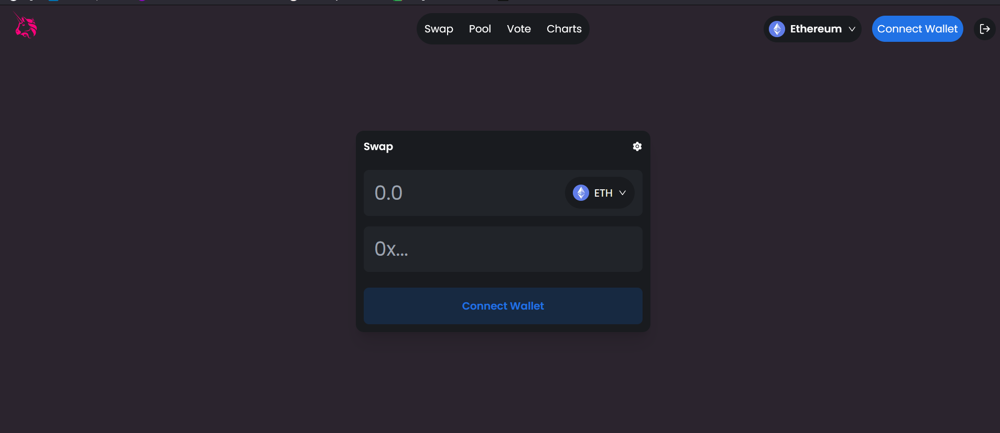
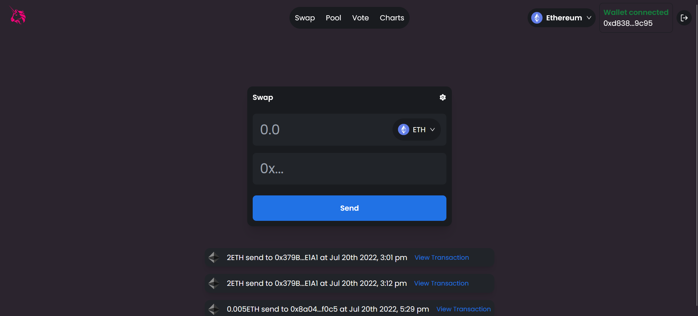

# UNISWAP 2.0

A uniswap clone in which you can transfer ethereum crypto currency in anywhere in world with just one click with security of blockchain technology.

## Tech Stack Used

1. [Ethereum](https://ethereum.org/)
2. [Solidity](https://solidity.readthedocs.io/)
3. [Etherscan](https://etherscan.io/)
4. [MetaMask](https://metamask.io/)
5. [Web3](https://web3js.readthedocs.io/)
6. [Next JS](https://nextjs.org/)
7. [Tailwind CSS](https://tailwindcss.com/)
8. [Truffle](https://trufflesuite.com/)
9. [Ganache](https://trufflesuite.com/ganache/)
10. [Moralis](https://moralis.io/)

## Features

    * 1. Authentication using Moralis IO
    * 2. Secure transaction over ethereum blockchain
    * 3. Easy to use
    * 4. Easy to understand
    * 5. Using Moralis database to store transactions
    * 6. Truffle to deploy contract on ethereum blockchain
    * 7. Next JS to render frontend
    * 8. Tailwind CSS to style frontend
    * 9. Ganache to run ethereum blockchain

## Usage

    * 1. Connect meta mask account
    * 2. Use Goerli Testnet network
    * 3. Enter amount ethereum want to transfer
    * 4. Enter address of receiver
    * 5. Click on send button
    * 6. Wait for transaction to be mined
    * 7. Check your balance
    * 8. Check your transaction history
    * 9. Check your transaction details

## Screen Shots

